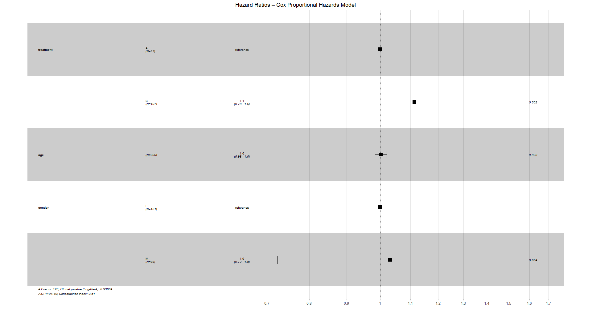
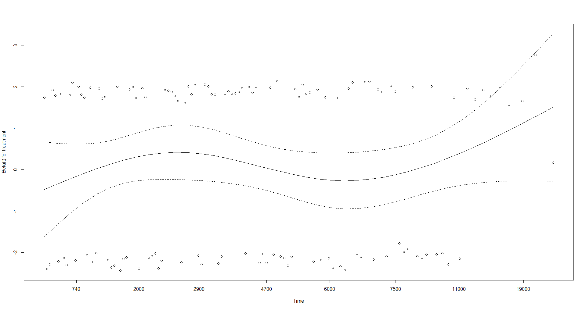
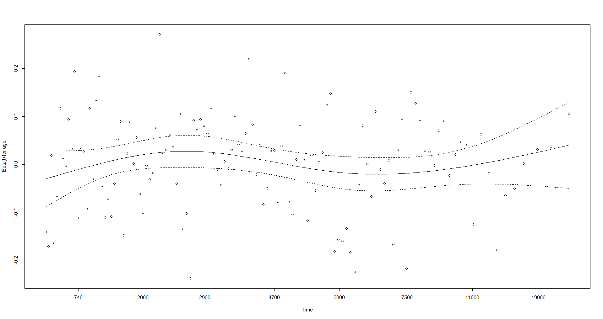
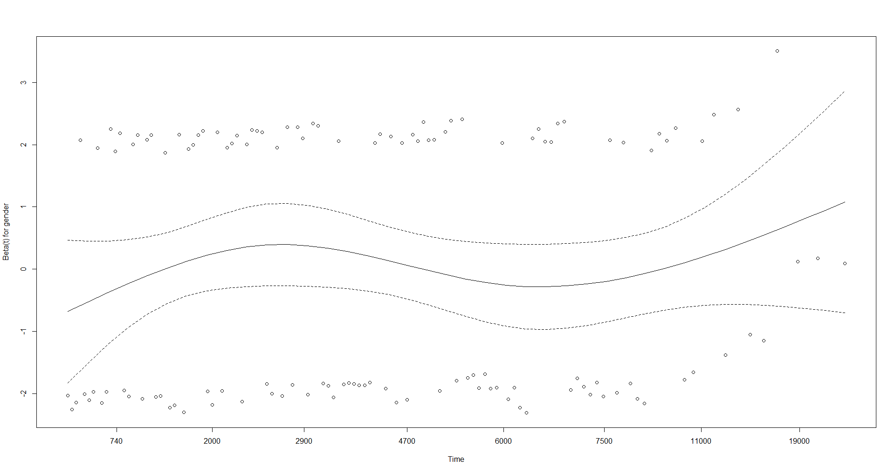

# Survival TLF Engine  

[](https://www.r-project.org/)
[](LICENSE)
[](#reproducibility--compliance)

> **Automated Tables, Listings, and Figures for Time-to-Event Endpoints in Clinical Trials**  
> Kaplan-Meier Curves • Log-Rank Test • Cox Proportional Hazards • Regulatory-Ready Outputs  

A lightweight, reproducible R toolkit for generating **statistical outputs aligned with clinical trial reporting standards** (e.g., ICH E9, CDISC). Designed for Phase II/III studies with time-to-event endpoints such as *overall survival (OS)*, *progression-free survival (PFS)*, or *disease-free survival (DFS)*.

---

## 🎯 Key Features

- ✅ **Kaplan-Meier survival curves** with confidence intervals & risk tables  
- ✅ **Log-Rank test** for group comparisons (e.g., treatment vs. control)  
- ✅ **Cox PH model** with multivariable adjustment & forest plots  
- ✅ **Assumption diagnostics** (proportional hazards via Schoenfeld residuals)  
- ✅ **Export-ready outputs**:  
  - Publication-quality plots (`ggplot2` + `survminer`)  
  - Summary tables in CSV/HTML (via `gt` or `flextable`)  
- ✅ **Template-driven**: easy to adapt to new studies or protocols  

---

## 🖼️ Example Output

### Kaplan-Meier Curves (Treatment Comparison)


> Simulated Phase III oncology trial (n=200). Log-Rank p = 0.021.

### Cox Model Forest Plot — Adjusted Hazard Ratios



> Hazard Ratios for treatment, age, and gender. Reference categories: Treatment A, Female. Global p-value (Log-Rank) = 0.936. Concordance Index = 0.51.

### Proportional Hazards Assumption Diagnostics

The following plots assess the proportional hazards assumption using **scaled Schoenfeld residuals**. A non-random pattern or trend over time suggests violation of PH.

#### Beta(t) for Treatment


#### Beta(t) for Age


#### Beta(t) for Gender


> No significant time-dependent trends observed — supports validity of the Cox PH model assumptions.

### Predicted Survival Probabilities for a New Patient

```text
Call: survfit(formula = cox_model, newdata = new_patient)

 time n.risk n.event survival std.err lower 95% CI upper 95% CI
   30    200       0    1.000  0.0000     1.000        1.000
   60    197       0    1.000  0.0000     1.000        1.000
  120    197       0    1.000  0.0000     1.000        1.000
  180    191       2    0.984  0.0094     0.966        1.000
  300    186       1    0.962  0.0147     0.934        0.995
  360    183       0    0.962  0.0147     0.934        0.992
```
> Predicted survival probability for a new patient (e.g., Treatment B, age 65, male) at 360 days: 96.2% (95% CI: 93.4% – 99.2%). 

---

## 🧪 Reproducibility & Compliance

- ✅ **Version control (Git + GitHub)  
- ✅ **Explicit data provenance (input/output documentation) 
- ✅ **Parameterized scripts (no hard-coded paths/values)
- ✅ **Session info logged (sessionInfo() in output logs)
- ✅ **No hidden side effects (pure functions, no global assignments)

```text
---

## 🚀 How to Use

- R ≥ 4.0  
- Required packages: `survival`, `survminer`, `ggplot2`, `gt`, `broom`

```r
# Install dependencies
install.packages(c("survival", "survminer", "ggplot2", "gt", "broom"))


